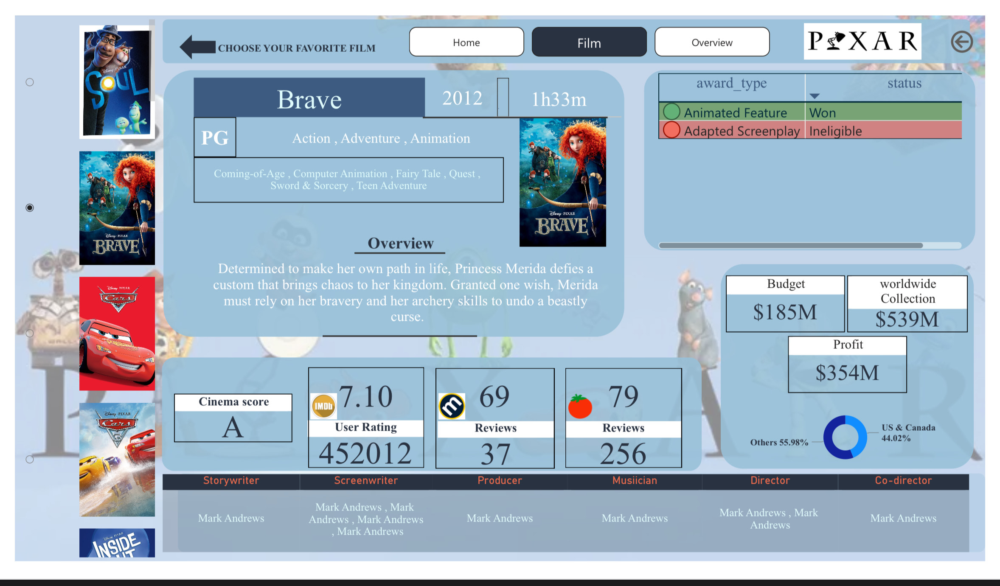

# 🎬 Pixar 30 Dashboard (Power BI)

A storytelling Power BI dashboard analyzing Pixar’s top 30 movies by box office revenue, ratings, and release year.

### 📋 Notes
The interactive dashboard I created was part of a Maven challenge, and it helped me learn many new skills.

---
## 🛠 Tools Used
- Power BI  
- Excel (data preparation)  
- DAX
---
## 🎯 Objectives
- Analyze performance of Pixar movies over time  
- Compare audience vs critic ratings  
- Highlight highest-grossing films

---
## 📊 Overview 
- Total Films : 28 films  
- Total budget : 4,351M $
- worldwide collection : 17,043M $
- Total Profit : 12,692M $
---
## 🏆 Key Results 
- The best profit film : INSIDE OUT 2
- Highest profit year : 2024
- A total of 28 films were product between 1995 and 2024 

 --- 
## 📸 Dashboard Preview

---
## 📂 Files
- https://github.com/Muna5abdullah/Pixar-s-30Th-Anniversary-/blob/main/Pixar's%2030Th%20dashboard.pbix  
- https://github.com/Muna5abdullah/Pixar-s-30Th-Anniversary-/blob/main/Pixar's%2030Th%20dashboard.pdf
---
## 🗂️ Data Source
- https://mavenshowcase.com/project/29961
